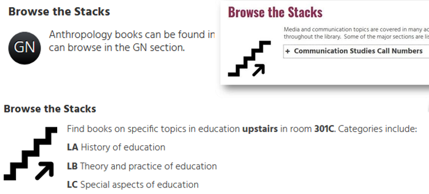
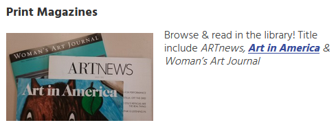

# Research Guides
A place to gather best practices

# Guide Parts

# I. Intro Statement
Note: Not a heading level.  Examples:
* **Objective:** To support the research needs of  Whatcom students in the [Nursing](http://whatcom.edu/academics/degrees-certificates/nursing) program.
* **Purpose:** Philosophy is a major academic field that covers many topics. WCC offers several courses on philosophy including Critical Thinking, Logic, Ethics and Religion. This guide is meant to help students find the best research sources both within the libraries collection and on the open web.

When in a **Tabbed Guide**, can be under the H2 tab titled: "Introduction"
* Political Science is the study of systems of government, politics, and power. WCC offers courses on Political Science including Political Theory, American Governement, International Relations, and Comparative Government. This guide is meant to help students find the best sources for both within the libraries collection and on the open web, as well as resources for keeping current on political news and events. [see example here](http://librarywp.whatcom.edu/home/polisci/)

# II. Print materials

Call Numbers should always be displayed with spaces, bolded on the first part.

**HB 345** .F45U78 2009

## H2 or H3 Browse the Stacks
* Stacks range
    * Simple - use [dropcap]##[/dropcap] (max 2 letters).
    * Complex - use [spoiler][/spoiler]
    * Combo - [see example](http://librarywp.whatcom.edu/home/polisci/)
    

## H2 Print Magazines (if exists)
* Use if there is a small sample.  For example
  
 
 
# III. Background Information (H2 or H3)
* [icon name="film"] FilmsOnDemand: Eduction
* [icon name="book"] Credo Topics: Geography 

# IV. Featured Databases (if exists)
<code>[row][column size="1/3"][pods name="authenticated_databa" slug="cmmc" template="Authdbs Logo (full) with Link"][/column]
[column size="2/3"][pods name="authenticated_databa" slug="cmmc" template="AuthDbs - Single Line (wcc logo)"][/column][/row]</code>
 

# V. eBooks
RSS Feed (Get code from Christy)

   

# VI. Journals 
* Example top journals we have access to (whether OA or db) 
* (optional) Mention: [A-Z Journals]
* (optional) Mention: Still can't find a particular article? Request articles through [Interlibrary Loan](http://library.whatcom.edu/services/interlibrary-loan)

## Journals/pMags together
   

# VII. Keep Learning or Keeping Up With... (tab) - optional
Examples:
* [Anthropology](http://librarywp.whatcom.edu/home/anthropology/)
* [Computer Science](http://librarywp.whatcom.edu/home/cs/)
* [Economics](http://librarywp.whatcom.edu/home/econ/)

# Developer Notes

* [Example Guide to draw upon for Ro](https://ulib.iupui.edu/guides/libguides-best-practices)
* [Exaple from Illinois](https://publish.illinois.edu/libraryweb/)

# Database Training & Orientation Videos - Put these in "auth_dbs" posts.
* eLibrary Training Video 
*	eLibrary Curriculum Edition 2-Minute Video 
*	History Study Center Training Video 
*	History Study Center 2-Minute Overview 
*	ProQuest Learning: Literature Training Video 
*	SIRS Discoverer Full Training 
*	CultureGrams 4-Minute Overview 
